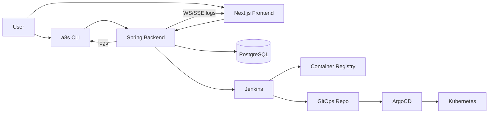

# 02 - End-to-End Integration

## High-level integration diagram

## Detailed request flow

### 1) Authentication flow (Frontend)

1. User signs in with GitHub via NextAuth.
2. NextAuth callback receives `access_token`.
3. Frontend server route posts token to backend `POST /api/v1/auth/github`.
4. Backend verifies token against GitHub `/user`, encrypts token, stores in DB.
5. Backend returns signed backend JWT.
6. Frontend stores backend JWT in session for API + WebSocket calls.

### 2) Authentication flow (CLI)

1. `a8s login` uses GitHub PAT or device flow.
2. CLI exchanges GitHub token with backend `POST /api/v1/auth/github`.
3. CLI stores backend JWT in `~/.a8s-cli.json`.

### 3) Deployment flow

1. Client calls `POST /api/v1/projects` (Spring stack) or `POST /api/v1/projects/{id}/deploy` (FastAPI stack).
2. Backend validates user/project and triggers Jenkins `buildWithParameters`.
3. Jenkins queue item id is returned to backend/client.
4. Jenkins pipeline builds image tag `<user>-<build>-<sha>`.
5. Jenkins pushes image to registry.
6. Jenkins script updates GitOps path: `apps/<user>/<project>/values.yaml`.
7. ArgoCD auto-sync applies Deployment/Service/Ingress/HPA.
8. Backend and UI show deployment status/log stream.

### 4) Live log flow (Spring stack)

1. Frontend opens WebSocket `/ws/jenkins/logs?job=...&queueItem=...&token=...`.
2. Handshake interceptor validates JWT.
3. Backend resolves queue item -> build number.
4. Backend polls Jenkins progressive log endpoint.
5. Backend pushes `queued/open/log/heartbeat/done/error` events to frontend.

## Integration contracts

- Jenkins trigger response must include queue location header.
- GitOps values file must keep marker comment for image tag replacement:
  `# managed-by-jenkins-image-tag`
- ArgoCD ApplicationSet expects directory pattern: `apps/*/*`.
- Tenant namespace convention: `user-<userId-slug>`.
