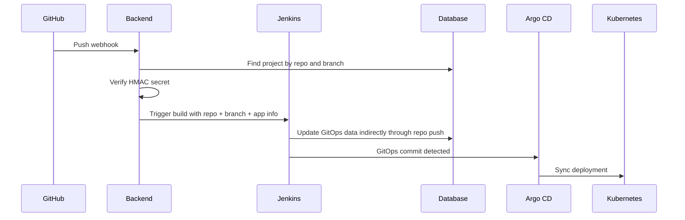
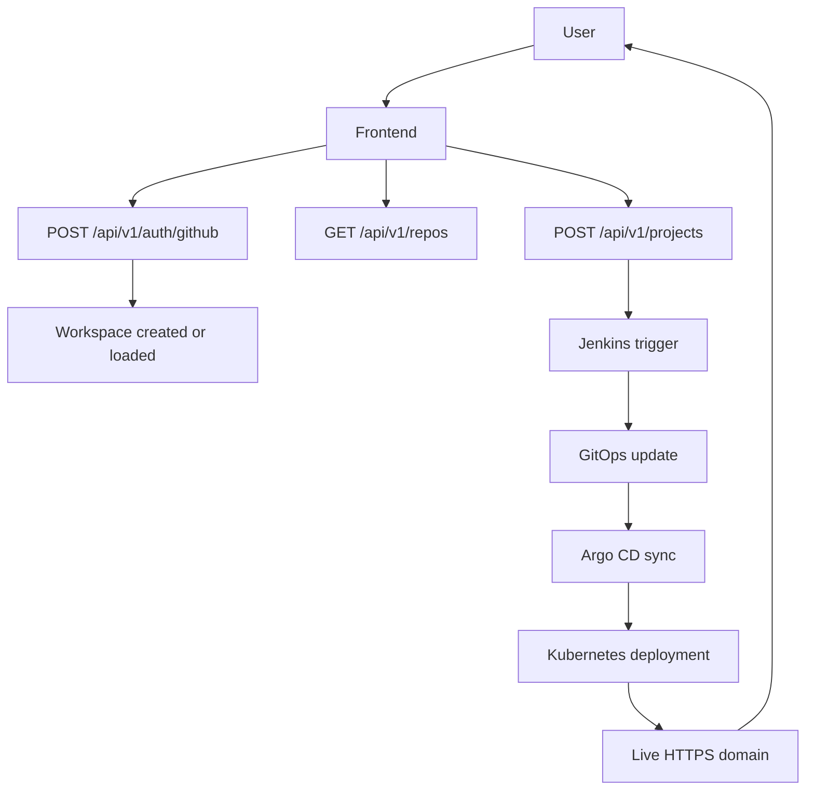

# Backend Guide

This document explains how the backend works, what each code layer is responsible for, what data is stored in the database, and how the frontend talks to the backend APIs.

The backend is the control plane API for the platform. It keeps user state, talks to GitHub and Jenkins, stores project metadata, and streams build logs back to the UI.

## What the backend does

The backend is responsible for:

- GitHub login exchange
- repository and branch discovery
- project and workspace records
- Jenkins build triggering
- Jenkins log streaming
- webhook creation and verification
- custom domain management
- GitHub token storage with encryption

In short, the frontend asks the backend what to do, and the backend coordinates GitHub, Jenkins, the database, and the live deployment state.

## Code Map

The backend is a Spring Boot app with a standard layered structure.

| Folder or file | Meaning |
| --- | --- |
| `MonoloticAppBackendApplication.java` | Application entry point that starts Spring Boot |
| `config/` | Security, CORS, and WebSocket configuration |
| `controller/` | REST API layer exposed to the frontend and webhooks |
| `dto/` | Request and response shapes used by the controllers |
| `model/` | JPA entities that map to database tables |
| `repository/` | Spring Data JPA database access layer |
| `service/` | Business logic interfaces |
| `service/impl/` | Real service implementations |
| `websocket/` | Jenkins log WebSocket handler |
| `src/main/resources/application.yaml` | Minimal bootstrap config, activates the `dev` profile |
| `build.gradle` | Java 21, Spring Boot, JPA, WebSocket, WebFlux, Security, PostgreSQL dependencies |

Important note:

- runtime secrets and connection settings are expected from the active profile or environment
- this repo snapshot only shows `application.yaml`, which turns on the `dev` profile

## Runtime Config

These values are read from environment or profile-specific config:

- `spring.datasource.*` for PostgreSQL
- `spring.security.oauth2.resourceserver.jwt.secret`
- `token.encryption.key`
- `cors.allowed-origins`
- `jenkins.url`
- `jenkins.user`
- `jenkins.token`
- `platform.domain`
- `platform.webhook.public-base-url`
- `gitops.branch`
- `jenkins.enable-gitops-update`

If one of these is missing, the related feature will fail.

## Database Model

The backend uses PostgreSQL through Spring Data JPA.

### `workspaces`

Entity: `model/Workspace.java`

Purpose:

- stores one personal workspace per user
- groups projects by tenant/workspace

Main fields:

- `id`
- `ownerUserId`
- `name`
- `slug`
- `createdAt`
- `updatedAt`

Important behavior:

- `WorkspaceServiceImpl` creates a workspace automatically when a user logs in for the first time
- the slug is generated from the user id, usually prefixed with `ws-`

### `projects`

Entity: `model/Project.java`

Purpose:

- stores deployment records
- stores repo connection state
- stores webhook state
- stores live URL and domain information

Main fields:

- `id`
- `userId`
- `workspaceId`
- `workspaceSlug`
- `appName`
- `repoUrl`
- `branch`
- `framework`
- `status`
- `url`
- `customDomain`
- `appPort`
- `repoProvider`
- `repoFullName`
- `webhookSecret`
- `webhookName`
- `webhookProviderId`
- `autoDeployEnabled`
- `createdAt`
- `updatedAt`

Important behavior:

- `appName` is the app slug used in URLs and release naming
- the controller sets `status` to `BUILDING` during deploys
- the URL is generated from `appName + workspaceKey` unless a custom domain is set

Useful status values:

- `BUILDING`
- `DEPLOYED`
- `FAILED`

### `github_tokens`

Entity: `model/GitHubToken.java`

Purpose:

- stores the user's GitHub OAuth token securely
- lets the backend call GitHub APIs later without exposing the raw token to the frontend

Main fields:

- `id`
- `userId`
- `encryptedToken`
- `iv`
- `createdAt`
- `updatedAt`

Important behavior:

- token content is encrypted with AES-GCM
- the frontend never receives the raw stored token back from the database

## Repository Layer

The repositories are Spring Data JPA interfaces:

| Repository | What it reads or writes |
| --- | --- |
| `GitHubTokenRepository` | GitHub OAuth token storage |
| `ProjectRepository` | Project deployment records |
| `WorkspaceRepository` | Workspace ownership and lookup |

Common repository operations:

- find projects by user
- find projects by workspace
- count projects in a workspace
- locate a project by repo full name
- locate a token by user id

## Security and Authentication

The backend uses JWT for authenticated frontend requests.

Flow:

1. The user signs in with GitHub in the frontend.
2. NextAuth gets the GitHub access token.
3. The frontend exchanges that token with `POST /api/v1/auth/github`.
4. The backend verifies the token with GitHub.
5. The backend stores the encrypted GitHub token in the database.
6. The backend returns its own JWT, called `backendToken`.
7. The frontend sends `Authorization: Bearer <backendToken>` on later requests.

Why this matters:

- the frontend never talks to GitHub directly for protected backend operations
- the backend uses the JWT subject as the user id
- the same backend token is also used for Jenkins log streaming

Important config:

- `SecurityConfig` enables stateless sessions
- CORS is controlled by `cors.allowed-origins`
- WebSocket handshake auth uses the JWT query token

## Controllers and APIs

The backend exposes **17 REST endpoints** plus **1 WebSocket endpoint**.

### 1. AuthController

Base path:

- `/api/v1/auth`

Endpoint:

- `POST /api/v1/auth/github`

What it does:

- verifies the GitHub access token
- stores the token encrypted in PostgreSQL
- creates or reuses the personal workspace
- returns a backend JWT and workspace metadata

Frontend usage:

- called during GitHub login / session sync

Request body:

```json
{
  "token": "<github-access-token>"
}
```

### 2. RepoController

Base path:

- `/api/v1/repos`

Endpoints:

- `GET /api/v1/repos`
- `GET /api/v1/repos/branches?repoFullName=owner/repo`

What they do:

- list the authenticated user's GitHub repositories
- list branches for one selected repository

Frontend usage:

- used by repo picker screens
- used when the user selects a repository and then chooses a branch

### 3. WorkspaceController

Base path:

- `/api/v1/workspaces`

Endpoint:

- `GET /api/v1/workspaces/me`

What it does:

- returns the current user workspace
- also returns the number of projects in that workspace

Frontend usage:

- used to show the user workspace name and project count

### 4. ProjectController

Base path:

- `/api/v1/projects`

Endpoints:

- `POST /api/v1/projects`
- `GET /api/v1/projects`
- `GET /api/v1/projects/{projectId}`
- `POST /api/v1/projects/{projectId}/repository/connect`
- `PATCH /api/v1/projects/{projectId}/auto-deploy`
- `PATCH /api/v1/projects/{projectId}/domain`
- `GET /api/v1/projects/{projectId}/webhook`
- `POST /api/v1/projects/{projectId}/webhook`
- `POST /api/v1/projects/{projectId}/webhook/rotate`
- `DELETE /api/v1/projects/{projectId}/webhook`
- `POST /api/v1/projects/{projectId}/sync`

What these do:

- create a new deployment record
- list all projects in the current workspace
- load one project
- connect a repository to an existing project
- turn auto deploy on or off
- set a custom domain
- read webhook configuration
- create webhook configuration
- rotate webhook secret
- delete webhook configuration
- trigger a manual Jenkins sync

Important backend logic:

- `createProject` triggers Jenkins first, then persists the project record
- `syncProject` triggers Jenkins again for a manual redeploy
- `connectRepository` can auto-create a GitHub webhook if auto deploy is enabled
- `setProjectDomain` normalizes and validates the custom domain
- `deleteWebhook` also tries to delete the GitHub webhook on the provider side

Host naming logic:

- default host is generated from `appName + workspaceKey`
- the final public host becomes `<slugified-app-and-workspace>.<platform-domain>`
- if a custom domain is provided, it overrides the default host

Frontend usage:

- this is the main controller the dashboard uses
- most deploy screens and project detail screens talk to these endpoints

### 5. JenkinsController

Base path:

- `/api/v1/jenkins`

Endpoint:

- `GET /api/v1/jenkins/logs/stream?job=<job>&build=<build>`

What it does:

- opens an SSE log stream for a Jenkins build
- used when the frontend wants a server-sent log stream

### 6. WebhookController

Base path:

- `/api/v1/webhooks`

Endpoint:

- `POST /api/v1/webhooks/github`

What it does:

- receives GitHub push webhooks
- verifies `X-Hub-Signature-256`
- checks repo full name and branch
- finds the matching project
- triggers Jenkins again if auto deploy is enabled

This endpoint is called by GitHub, not by the browser.

### 7. WebSocket endpoint

Path:

- `/ws/jenkins/logs`

What it does:

- streams Jenkins logs over WebSocket
- supports either `build=<number>` or `queueItem=<id>`
- validates the backend JWT in the `token` query parameter

Frontend usage:

- used by the dashboard for live log updates

## Total API Count

If you count the backend endpoints directly:

- **17 REST endpoints**
- **1 WebSocket endpoint**

If you count how the frontend uses them:

- 12 direct REST helper calls in `src/lib/api.ts`
- 1 auth exchange through NextAuth and `POST /api/v1/auth/github`
- 1 Jenkins log stream path through WebSocket or the SSE proxy
- 1 external GitHub webhook callback

## Frontend Request Map

The frontend request helpers in `src/lib/api.ts` call these backend APIs:

| Frontend helper or route | Backend endpoint | Purpose |
| --- | --- | --- |
| NextAuth login / sync token | `POST /api/v1/auth/github` | Store GitHub token and return backend JWT |
| `getUserRepos` | `GET /api/v1/repos` | List repositories visible to the user |
| `getRepoBranches` | `GET /api/v1/repos/branches?repoFullName=...` | List branches for one repo |
| `getMyWorkspace` | `GET /api/v1/workspaces/me` | Load the current workspace |
| `deployProject` | `POST /api/v1/projects` | Create a new deploy and trigger Jenkins |
| `getUserProjects` | `GET /api/v1/projects` | Load all projects in the workspace |
| `getProjectById` | `GET /api/v1/projects/{projectId}` | Load one project |
| `connectProjectRepository` | `POST /api/v1/projects/{projectId}/repository/connect` | Attach repo and webhook settings |
| `setProjectAutoDeploy` | `PATCH /api/v1/projects/{projectId}/auto-deploy` | Enable or disable auto deploy |
| `syncProjectDeploy` | `POST /api/v1/projects/{projectId}/sync` | Manually redeploy the project |
| `getProjectWebhook` | `GET /api/v1/projects/{projectId}/webhook` | Read webhook details |
| `createProjectWebhook` | `POST /api/v1/projects/{projectId}/webhook` | Create webhook details |
| `rotateProjectWebhook` | `POST /api/v1/projects/{projectId}/webhook/rotate` | Rotate webhook secret |
| `deleteProjectWebhook` | `DELETE /api/v1/projects/{projectId}/webhook` | Remove webhook config |
| Jenkins log stream route | `GET /api/v1/jenkins/logs/stream` or `/ws/jenkins/logs` | Live build logs |

## Request Examples

### Login exchange

```bash
curl -X POST http://localhost:8080/api/v1/auth/github \
  -H 'Content-Type: application/json' \
  -d '{"token":"<github-access-token>"}'
```

### Create a project

```bash
curl -X POST http://localhost:8080/api/v1/projects \
  -H "Authorization: Bearer <backend-token>" \
  -H 'Content-Type: application/json' \
  -d '{
    "repoUrl":"https://github.com/tochratana/dpl-test.git",
    "branch":"main",
    "appName":"my-app",
    "appPort":3000
  }'
```

### Connect a repository to an existing project

```bash
curl -X POST http://localhost:8080/api/v1/projects/<projectId>/repository/connect \
  -H "Authorization: Bearer <backend-token>" \
  -H 'Content-Type: application/json' \
  -d '{
    "repoProvider":"github",
    "repoUrl":"https://github.com/tochratana/dpl-test.git",
    "repoFullName":"tochratana/dpl-test",
    "branch":"main",
    "autoDeployEnabled":true
  }'
```

### Trigger a manual sync

```bash
curl -X POST http://localhost:8080/api/v1/projects/<projectId>/sync \
  -H "Authorization: Bearer <backend-token>"
```

## Main Service Layer

### `WorkspaceServiceImpl`

What it does:

- creates a personal workspace for a user if one does not already exist
- returns the existing workspace if it already exists

Why it matters:

- every user needs one workspace namespace for project grouping

### `GitHubServiceImpl`

What it does:

- decrypts the user's stored GitHub token
- calls GitHub API to list repositories
- calls GitHub API to list branches

Why it matters:

- the frontend repo picker depends on it
- the backend never returns the raw token to the browser

### `JenkinsServiceImpl`

What it does:

- triggers Jenkins builds with form parameters
- passes repo URL, branch, app name, port, user ID, workspace ID, and custom domain
- adds Jenkins crumb if the instance requires it
- resolves queue item IDs to build numbers
- streams build logs through SSE or the WebSocket layer

Why it matters:

- this is the main CI integration point
- the frontend sees live queue/build progress through this service

### `WebhookServiceImpl`

What it does:

- generates webhook secrets
- encrypts and decrypts secrets
- computes HMAC-SHA256 signatures
- creates, updates, and deletes GitHub webhooks
- builds the public webhook URL from `platform.webhook.public-base-url`

Why it matters:

- this is how push events turn into automatic redeploys

### `TokenEncryptionServiceImpl`

What it does:

- encrypts GitHub tokens and webhook secrets with AES-GCM
- decrypts them when the backend needs to call GitHub

Why it matters:

- sensitive tokens are not stored in plain text

### `JenkinsLogStreamListener`

What it does:

- defines the callback contract used by Jenkins log streaming

Events:

- `onOpen`
- `onLog`
- `onQueued`
- `onHeartbeat`
- `onDone`
- `onError`

Why it matters:

- the WebSocket handler and the Jenkins service share this callback shape

## Webhook Flow

This is the auto deploy path:

1. GitHub receives a push.
2. GitHub sends a webhook to `POST /api/v1/webhooks/github`.
3. The backend checks the event type, repo, branch, and signature.
4. The backend finds the matching project.
5. The backend checks whether auto deploy is enabled.
6. The backend triggers Jenkins.
7. Jenkins builds the app and updates GitOps.
8. Argo CD syncs the new desired state into Kubernetes.



## Deploy Flow

This is the normal user deploy path from the UI:

1. User logs in with GitHub.
2. Frontend receives backend JWT.
3. Frontend lists repos and branches.
4. User clicks deploy.
5. Frontend sends `POST /api/v1/projects`.
6. Backend creates the project record.
7. Backend triggers Jenkins.
8. Jenkins builds, scans, pushes, and writes GitOps values.
9. Argo CD syncs the manifests.
10. Frontend shows the live URL.



## Practical Notes

- If `GET /api/v1/repos` fails, the stored GitHub token is missing or expired.
- If `POST /api/v1/webhooks/github` returns `401`, the webhook signature or secret is wrong.
- If `POST /api/v1/projects/{id}/sync` fails, Jenkins credentials or the repo URL may be wrong.
- If the backend cannot stream logs, the WebSocket token is missing or invalid.
- If a custom domain is rejected, it must match the backend validation rules.
- If auto deploy is off, GitHub pushes will be ignored by design.

## Summary

The backend is the control plane for the whole platform.

It does four jobs:

1. manages identity and workspace state
2. talks to GitHub for repos, branches, and webhooks
3. talks to Jenkins for builds and logs
4. stores deployment records and live URLs in PostgreSQL

If the frontend is the dashboard, the backend is the brain, and Jenkins plus GitOps are the delivery engine.
