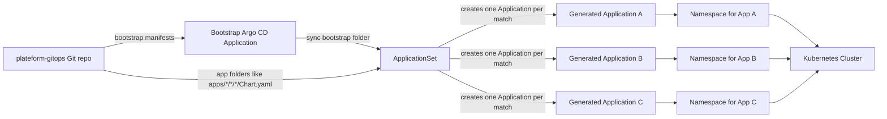

# Argo CD Explained

Argo CD is the part of this platform that keeps Kubernetes in sync with Git.

The short answer to your question is:

- **ApplicationSet** is the blueprint or factory
- **Application** is the generated deploy object for one app
- **One ApplicationSet can create many Applications**
- Each generated Application can point to a different app folder, namespace, image tag, and host

So Argo CD does not need one separate controller definition for every deployed app.
It needs:

1. one bootstrap Application
2. one ApplicationSet
3. many generated Applications created from Git

## Easy way to explain it to a client

Think of it like this:

- **ApplicationSet** = a factory template
- **Application** = one finished product made by the factory
- **Git repo** = the source file the factory reads
- **Kubernetes** = the place where the finished product is delivered

When a new app folder appears in Git, the factory produces a new Argo CD Application automatically.
When an app folder changes, the factory updates that Application.
When an app folder is removed, the factory removes that Application too.

## How it works in this platform

The platform uses the **app-of-apps** pattern:

1. A bootstrap Argo CD Application is applied first.
2. That bootstrap Application points to the bootstrap folder in `plateform-gitops`.
3. Inside that folder is the `ApplicationSet` manifest.
4. The `ApplicationSet` scans the Git repo for app folders.
5. For every matching folder, it creates a separate Argo CD Application.
6. Each Application deploys one tenant app into its own namespace.

## Workflow diagram

## Why one ApplicationSet can generate many Applications

The key idea is that the ApplicationSet does not describe a single app.
It describes a **pattern**.

In this platform, the pattern is something like:

- find every `Chart.yaml` under the tenant app folders
- read the folder path
- use the path to build:
  - Application name
  - namespace
  - project label
  - image values
  - host/domain values

So if Git contains 1 app folder, Argo CD creates 1 Application.
If Git contains 20 app folders, Argo CD creates 20 Applications.

That is why the UI may show one `ApplicationSet`, but you see many generated apps underneath it.

## Object map

| Argo CD object | What it means | In this platform |
| --- | --- | --- |
| Application | One deployable unit | One tenant app, one namespace, one Helm release |
| ApplicationSet | Generator for Applications | Scans Git and creates one Application per app folder |
| AppProject | Permission boundary | Controls which repo and cluster destination the app can use |
| Bootstrap Application | Starter app | Installs the bootstrap manifests from Git |

## What changes when a new app is deployed

When Jenkins writes a new app folder into `plateform-gitops`:

1. Argo CD notices the Git commit changed.
2. The ApplicationSet scans the repo again.
3. It finds the new app folder.
4. It creates a new Argo CD Application for that app.
5. That Application renders the Helm chart.
6. Kubernetes gets the new Deployment, Service, Ingress, and Namespace.

## What changes when an app is updated

If Jenkins updates only the image tag or host in the values file:

1. The same Application still exists.
2. Argo CD compares live cluster state with Git state.
3. It sees the new image tag or values.
4. It applies only the difference.

## What changes when an app is removed

If the folder disappears from Git:

1. The ApplicationSet no longer finds a match.
2. The generated Application is removed.
3. The live resources can be pruned if pruning is enabled.

## Simple mental model

If you need a very short client explanation, use this:

> We keep one Argo CD ApplicationSet as a factory.  
> The factory reads Git and creates one Argo CD Application per deployed app.  
> Each Application deploys one tenant into its own namespace, so the platform can host many apps from one GitOps repo.

## Where this shows up in your repo

- Bootstrap manifests live in `plateform-gitops/bootstrap/`
- Tenant app folders live under `plateform-gitops/apps/`
- Jenkins writes the tenant app values and then Argo CD syncs them

