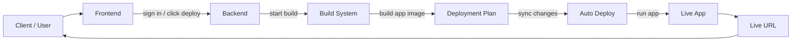

# Client Story

This is the simplest version of the platform story.

Use this page when you want to explain the product to a client without too much technical detail.

## One-minute explanation

The user signs in, chooses a project, clicks deploy, and the platform does the rest:

1. It checks the code.
2. It builds the app.
3. It saves the image.
4. It writes the deployment plan.
5. It deploys the app to Kubernetes.
6. It gives the user a live link.
7. If needed, it can roll back to an older version.

## Simple flow

## What each step means

### 1. Sign in

The user opens the platform and signs in.

### 2. Create or choose a project

The user chooses what to deploy:

- monolithic app
- database
- spring microservice

### 3. Click deploy

The platform starts the build automatically.

### 4. Build and publish

The build system creates the app image and stores it safely.

### 5. Update deployment plan

The platform writes the new version into Git so the deployment is recorded.

### 6. Auto deploy

The deployment system watches Git and updates the cluster automatically.

### 7. Open the live app

After deployment, the user gets the public URL and can open the app.

## How to explain it to a client

You can say:

> “The platform turns code into a live app automatically.  
> The user clicks deploy, the system builds it, stores it, deploys it, and gives back a live link.”

## Why this is useful

- no manual Kubernetes work
- no manual server setup
- easy rollback
- clear deployment history
- works for multiple project types

## Summary

This is a simple deploy platform:

- frontend for the user
- backend for the logic
- build system for packaging
- Git for deployment history
- auto deploy system for syncing
- Kubernetes for running the app

