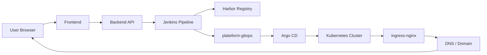
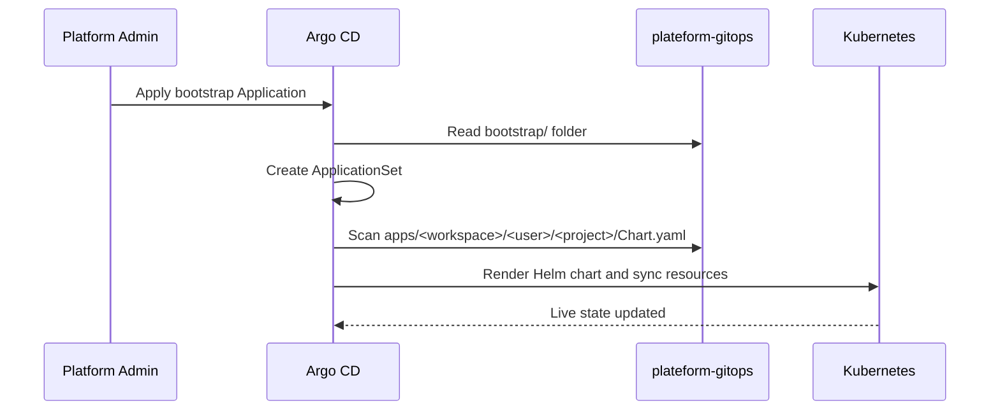

# GitOps Guide

This page explains how GitOps works in this platform, what each file in `plateform-gitops` is for, and how Jenkins, Argo CD, and Kubernetes fit together.

The short version is:

- Git is the source of truth
- Jenkins writes the desired state into Git
- Argo CD watches Git and applies the change
- Kubernetes runs the app that Argo CD rendered from Git

## What GitOps means here

In this platform, GitOps means we do **not** deploy by hand with `kubectl apply` for every app release.

Instead:

1. Jenkins builds the image and pushes it to Harbor.
2. Jenkins updates the GitOps repo with the new image tag and runtime values.
3. Argo CD detects the Git change.
4. Argo CD renders the Helm chart from `plateform-gitops`.
5. Argo CD applies the Kubernetes resources to the cluster.

That makes Git the audit trail for every live deployment.

## Big Picture Workflow



## GitOps flow step by step

### 1. The user clicks Deploy

The frontend sends the deploy request to the backend.

The backend already knows:

- user id
- workspace id
- repository URL
- selected branch
- optional custom domain
- current deployment status

### 2. The backend triggers Jenkins

The backend asks Jenkins to start the pipeline.

Jenkins receives the app metadata and uses it to build:

- the image name
- the image tag
- the release folder
- the ingress host
- the namespace target

### 3. Jenkins builds and publishes the image

Jenkins then:

1. checks out the user repo
2. detects the framework
3. generates a Dockerfile if needed
4. builds the image
5. scans the image
6. pushes the image to Harbor

The image tag is immutable, so each deploy points to one specific build.

### 4. Jenkins updates `plateform-gitops`

This is the GitOps handoff.

Jenkins updates the tenant app folder in GitOps, usually:

```text
apps/<workspaceId>/<userId>/<projectName>/
```

The release values written there normally include:

- `image.repository`
- `image.tag`
- `name`
- `namespace`
- `host`
- `ingress.tls`
- app port
- framework

### 5. Argo CD detects the Git change

Argo CD watches the GitOps repo.

When Jenkins pushes a new commit:

- Argo CD sees the new desired state
- Argo CD generates the Helm manifest
- Argo CD compares it with the live cluster
- Argo CD syncs the difference into Kubernetes

### 6. Kubernetes serves the app

After the sync:

- Deployment runs the new image
- Service exposes the pod internally
- Ingress exposes the host externally
- DNS points the hostname to the ingress endpoint

## `plateform-gitops` folder map

```text
bootstrap/
  argocd-app-of-apps.yaml
  applicationset-user-projects.yaml
  user-app-template.yaml
  apps-namespace.yaml
  namespace.yaml
  registery-secret.yaml

apps/
  <workspaceId>/
    <userId>/
      <projectName>/
        Chart.yaml
        values.yaml
        templates/
          deployment.yaml
          service.yaml
          ingress.yaml
          hpa.yaml
```

## What each GitOps file does

| File | Purpose |
| --- | --- |
| `bootstrap/argocd-app-of-apps.yaml` | Boots the GitOps system by creating the main Argo CD Application that points at the `bootstrap/` folder |
| `bootstrap/applicationset-user-projects.yaml` | Generates one Argo CD Application per tenant app by scanning `apps/*/*/*/Chart.yaml` |
| `bootstrap/user-app-template.yaml` | Legacy file kept for reference; current deployments use ApplicationSet discovery instead |
| `bootstrap/apps-namespace.yaml` | Legacy file kept for reference; shared apps namespace is deprecated |
| `bootstrap/namespace.yaml` | Creates the `argocd` namespace |
| `bootstrap/registery-secret.yaml` | Documentation placeholder showing how registry credentials should be handled per tenant namespace |
| `apps/<workspaceId>/<userId>/<projectName>/values.yaml` | Live runtime settings for one deployed app |
| `apps/<workspaceId>/<userId>/<projectName>/Chart.yaml` | Helm chart metadata for one app |
| `apps/<workspaceId>/<userId>/<projectName>/templates/*` | Kubernetes manifests rendered by Helm |

## Bootstrap flow

The platform starts from one root Application:

1. Apply the bootstrap manifest into the `argocd` namespace.
2. Argo CD reads the `bootstrap/` folder from GitOps.
3. The bootstrap Application creates the ApplicationSet.
4. The ApplicationSet scans the `apps/` folder.
5. Each project folder becomes one generated Argo CD Application.
6. The generated Application syncs the live deployment.



## Generated app naming

To keep tenant deployments separate, the generated app uses a workspace-aware identity.

Current pattern:

- application name: `<workspaceId>-<userId>-<projectName>`
- Helm release name: `<userId>-<projectName>` truncated to Helm-safe length
- namespace: `user-<userId>`

This is why the release name must stay short enough for Helm.

## Why the repo structure matters

The repo layout is what makes multi-tenancy safe.

It gives us:

- isolation by user
- isolation by workspace
- a clear history of each deploy
- easy rollback by reverting Git
- no manual cluster edits

If a deployment fails, we can inspect the Git commit that introduced it instead of searching through live cluster changes.

## How Jenkins uses GitOps

Jenkins does not own the live cluster.

It only writes the next desired state.

Typical values Jenkins updates:

- image repository
- image tag
- domain or host
- namespace
- app name
- chart path
- sync-related values

That means Jenkins is the writer, Argo CD is the reader and reconciler.

## How Argo CD uses GitOps

Argo CD watches the repo and keeps the cluster aligned with Git.

When the repo changes, Argo CD:

1. fetches the latest commit
2. renders Helm
3. compares desired and live state
4. applies the diff
5. reports sync and health status in the UI

## What to change when you want to modify GitOps behavior

Use `plateform-gitops` when you want to change:

- the bootstrap app
- ApplicationSet discovery
- tenant folder structure
- namespace naming
- app release naming
- Helm chart values for live apps
- ingress host structure

Use `plateform-infra` when you want Jenkins to write different values into GitOps.

Use the backend when you want to change how the platform stores project metadata or calculates the live domain.

## Common troubleshooting

### Argo CD says repo cannot be fetched

Usually one of these is wrong:

- repo URL
- repo credentials
- host key trust
- GitHub deploy key

### ApplicationSet generates duplicate apps

That usually means the folder pattern is overlapping or the old legacy layout is still being scanned.

### Helm release name is invalid

That means the generated name is too long or not Helm-safe.

### App is synced but 404 on the browser

That usually means:

- DNS is not pointing to ingress yet
- ingress host does not match the generated host
- service or namespace is wrong

## Summary

GitOps is the heart of the deployment model:

- Jenkins writes the next state
- Argo CD applies the next state
- Kubernetes runs the next state

That is what keeps the platform repeatable, multi-tenant, and safe to operate.
