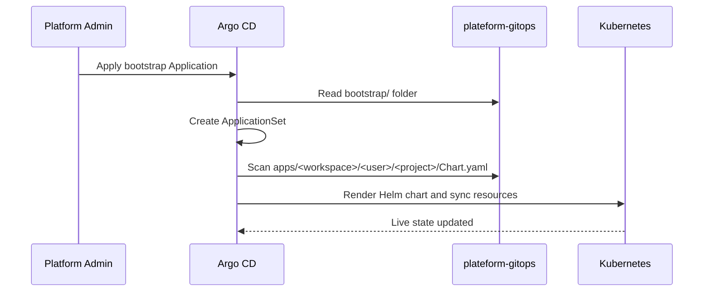

# End-to-End Workflow

This page explains how GitOps works in this platform, what each file in `plateform-gitops` is for, and how Jenkins, Argo CD, Kubernetes, and the database fit together.

The short version is:

- Git is the source of truth
- Jenkins writes the desired state into Git
- Argo CD watches Git and applies the change
- Kubernetes runs the app that Argo CD rendered from Git

## One-line client explanation

We build the app once, store the release state in Git, and let Argo CD keep the live cluster in sync automatically.

## What GitOps means here

In this platform, GitOps means we do **not** deploy by hand with `kubectl apply` for every app release.

Instead:

1. Jenkins builds the image and pushes it to Harbor.
2. Jenkins updates the GitOps repo with the new image tag and runtime values.
3. Argo CD detects the Git change.
4. Argo CD renders the Helm chart from `plateform-gitops`.
5. Argo CD applies the Kubernetes resources to the cluster.

That makes Git the audit trail for every live deployment.

## Combined Workflow

```mermaid
flowchart LR
  Client["Client / Browser"]
  Frontend["Frontend (Next.js)"]
  GitHub["GitHub (login + source repo)"]
  Backend["Backend API"]
  DB["PostgreSQL"]
  Jenkins["Jenkins Pipeline"]
  Harbor["Harbor Registry"]
  GitOps["GitOps Repo"]
  ArgoCD["Argo CD"]
  K8s["Kubernetes Cluster"]
  Ingress["ingress-nginx"]
  DNS["DNS / Domain"]

  Client -->|browse platform| Frontend
  Frontend -->|sign in with GitHub| GitHub
  GitHub -->|token / repo access| Frontend
  Frontend -->|deploy request: repo, branch, app name, domain| Backend
  Frontend <--> |WebSocket: live Jenkins logs| Backend
  GitHub -->|optional push webhook| Backend
  Backend -->|store project + version history| DB
  DB -->|previous image tag for rollback| Backend
  Backend -->|trigger build or rollback| Jenkins
  Jenkins -->|build + scan + push image| Harbor
  Jenkins -->|write release values| GitOps
  Jenkins -->|build log events| Backend
  GitOps -->|watched by| ArgoCD
  ArgoCD -->|render Helm + apply| K8s
  K8s -->|service + ingress| Ingress
  Ingress -->|public host| DNS
  DNS --> Client
```



## What each step means

### 1. The client opens the app

The user visits the platform in the browser and lands on the frontend.

The frontend is the screen the client sees:

- project list
- deploy form
- live logs
- live URL
- success and error messages

### 2. The user signs in with GitHub

The frontend asks GitHub to authenticate the user.

After login, the frontend gets access to the user's repositories and sends the platform token to the backend.

### 3. The user creates or deploys a project

When the user clicks **Deploy**, the frontend sends the deploy request to the backend.

The backend receives:

- repository URL
- branch
- project name
- user id
- workspace id
- app port
- platform domain
- optional custom domain

### 4. The backend stores the project and version history

The backend writes the project data into PostgreSQL.

This is where we keep:

- current deploy status
- live URL
- selected branch
- image tags
- previous versions for rollback
- webhook and auto-deploy state

### 5. The backend triggers Jenkins

The backend asks Jenkins to run the pipeline.

Jenkins then receives the metadata it needs to build the app:

- repository URL
- branch
- project name
- user id
- workspace id
- domain information

### 6. Jenkins builds the app image

Jenkins checks out the code, detects the framework, and builds the Docker image.

What happens inside Jenkins:

1. checkout the user repo
2. checkout the shared infra repo
3. detect the framework
4. prepare or reuse a Dockerfile
5. build the image
6. scan the image
7. upload scan results
8. push the image to Harbor

### 7. Jenkins updates GitOps

This is the GitOps handoff.

Jenkins writes the live values into the GitOps repo, usually under:

```text
apps/<workspaceId>/<userId>/<projectName>/
```

The release values usually include:

- image repository
- image tag
- app name
- namespace
- host
- ingress settings
- app port
- framework

### 8. Argo CD watches Git and syncs the cluster

Argo CD watches `plateform-gitops`.

When Jenkins pushes a new commit:

- Argo CD sees the new desired state
- Argo CD renders the Helm chart
- Argo CD compares the rendered result with the live cluster
- Argo CD applies the difference into Kubernetes

### 9. Kubernetes serves the app

After the sync:

- Deployment runs the new image
- Service exposes the pod internally
- Ingress exposes the host externally
- DNS points the hostname to the ingress endpoint

### 10. The frontend shows the live URL and logs

After the deploy succeeds, the frontend can show:

- the live domain
- the current status
- the Jenkins logs
- copy/open actions for the client

The log stream is a WebSocket connection from the browser to the backend, and the backend relays Jenkins log events in real time.

### 11. Rollback uses the same chain

If the client chooses to roll back to a previous version:

1. the frontend sends a rollback request to the backend
2. the backend looks up the previous image tag in PostgreSQL
3. the backend asks Jenkins to deploy that earlier version again
4. Jenkins updates GitOps with the old tag
5. Argo CD syncs the cluster back to the previous state

## `plateform-gitops` folder map

```text
bootstrap/
  argocd-app-of-apps.yaml
  applicationset-user-projects.yaml
  user-app-template.yaml
  apps-namespace.yaml
  namespace.yaml
  registery-secret.yaml

apps/
  <workspaceId>/
    <userId>/
      <projectName>/
        Chart.yaml
        values.yaml
        templates/
          deployment.yaml
          service.yaml
          ingress.yaml
          hpa.yaml
```

## What each GitOps file does

| File | Purpose |
| --- | --- |
| `bootstrap/argocd-app-of-apps.yaml` | Boots the GitOps system by creating the main Argo CD Application that points at the `bootstrap/` folder |
| `bootstrap/applicationset-user-projects.yaml` | Generates one Argo CD Application per tenant app by scanning `apps/*/*/*/Chart.yaml` |
| `bootstrap/user-app-template.yaml` | Legacy file kept for reference; current deployments use ApplicationSet discovery instead |
| `bootstrap/apps-namespace.yaml` | Legacy file kept for reference; shared apps namespace is deprecated |
| `bootstrap/namespace.yaml` | Creates the `argocd` namespace |
| `bootstrap/registery-secret.yaml` | Documentation placeholder showing how registry credentials should be handled per tenant namespace |
| `apps/<workspaceId>/<userId>/<projectName>/values.yaml` | Live runtime settings for one deployed app |
| `apps/<workspaceId>/<userId>/<projectName>/Chart.yaml` | Helm chart metadata for one app |
| `apps/<workspaceId>/<userId>/<projectName>/templates/*` | Kubernetes manifests rendered by Helm |

## Bootstrap flow

The platform starts from one root Application:

1. Apply the bootstrap manifest into the `argocd` namespace.
2. Argo CD reads the `bootstrap/` folder from GitOps.
3. The bootstrap Application creates the ApplicationSet.
4. The ApplicationSet scans the `apps/` folder.
5. Each project folder becomes one generated Argo CD Application.
6. The generated Application syncs the live deployment.



## Generated app naming

To keep tenant deployments separate, the generated app uses a workspace-aware identity.

Current pattern:

- application name: `<workspaceId>-<userId>-<projectName>`
- Helm release name: `<userId>-<projectName>` truncated to Helm-safe length
- namespace: `user-<userId>`

This is why the release name must stay short enough for Helm.

## Clean wording for the drawing

If you want to explain the diagram to a client, use these names:

| In the sketch | Better wording |
| --- | --- |
| `Next.ts` | `Frontend (Next.js)` |
| `backend get log from jenkins using SSE` | `Backend streams Jenkins logs to the browser over WebSocket` |
| `goharber` | `Harbor Registry` |
| `create project in argocd` | `Write the desired state to GitOps, then Argo CD syncs automatically` |
| `update gitops` | `Jenkins commits the new release values to the GitOps repo` |
| `login with provider` | `Sign in with GitHub` |
| `call api` | `Frontend talks to the backend API` |
| `streaming logs` | `Live build logs` |

## How to explain it to a client

You can describe the whole platform in one minute like this:

1. The client opens the frontend and signs in with GitHub.
2. The frontend sends the deploy request to the backend.
3. The backend stores the project and starts Jenkins.
4. Jenkins builds the app image, scans it, and pushes it to Harbor.
5. Jenkins updates the GitOps repo with the new release values.
6. Argo CD reads GitOps and applies the new version to Kubernetes.
7. The frontend shows the live URL and live build logs.
8. If needed, the client can roll back to a previous version from the database history.

## Why the repo structure matters

The repo layout is what makes multi-tenancy safe.

It gives us:

- isolation by user
- isolation by workspace
- a clear history of each deploy
- easy rollback by reverting Git
- no manual cluster edits

If a deployment fails, we can inspect the Git commit that introduced it instead of searching through live cluster changes.

## How Jenkins uses GitOps

Jenkins does not own the live cluster.

It only writes the next desired state.

Typical values Jenkins updates:

- image repository
- image tag
- domain or host
- namespace
- app name
- chart path
- sync-related values

That means Jenkins is the writer, Argo CD is the reader and reconciler.

## How Argo CD uses GitOps

Argo CD watches the repo and keeps the cluster aligned with Git.

When the repo changes, Argo CD:

1. fetches the latest commit
2. renders Helm
3. compares desired and live state
4. applies the diff
5. reports sync and health status in the UI

## What to change when you want to modify GitOps behavior

Use `plateform-gitops` when you want to change:

- the bootstrap app
- ApplicationSet discovery
- tenant folder structure
- namespace naming
- app release naming
- Helm chart values for live apps
- ingress host structure

Use `plateform-infra` when you want Jenkins to write different values into GitOps.

Use the backend when you want to change how the platform stores project metadata or calculates the live domain.

## Common troubleshooting

### Argo CD says repo cannot be fetched

Usually one of these is wrong:

- repo URL
- repo credentials
- host key trust
- GitHub deploy key

### ApplicationSet generates duplicate apps

That usually means the folder pattern is overlapping or the old legacy layout is still being scanned.

### Helm release name is invalid

That means the generated name is too long or not Helm-safe.

### App is synced but 404 on the browser

That usually means:

- DNS is not pointing to ingress yet
- ingress host does not match the generated host
- service or namespace is wrong

## Summary

GitOps is the heart of the deployment model:

- Jenkins writes the next state
- Argo CD applies the next state
- Kubernetes runs the next state

That is what keeps the platform repeatable, multi-tenant, and safe to operate.
