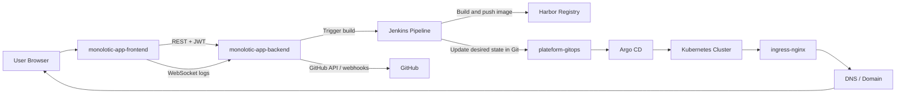

# Monolotic App Platform

Monolotic App Platform is a multi-tenant GitOps deployment platform for building, scanning, publishing, and exposing user applications from a single control plane.

This repository is the human-readable map for the whole `/devops` workspace. It explains what each sibling project does, how they talk to each other, and how a user app moves from GitHub source code to a live HTTPS domain.

## Platform name

Recommended name for the architecture:

**Monolotic Multi-Tenant GitOps CI/CD Platform**

Short description:

- **Multi-tenant** because each user/workspace gets isolated project folders and namespaces.
- **GitOps** because the Kubernetes desired state lives in Git and Argo CD applies it.
- **CI/CD** because Jenkins builds, scans, pushes, and updates GitOps on every deploy.

## Workspace map

```text
devops/
  monolotic-app-frontend/
  monolotic-app-backend/
  plateform-infra/
  plateform-gitops/
  project-docs/
```

## What each repo does

| Repo | Role | Main responsibility |
| --- | --- | --- |
| [monolotic-app-frontend](https://github.com/clouddeploylab/platform-frontend) | User portal | GitHub sign-in, repo browsing, deploy buttons, live Jenkins logs, deployment status, and live app URLs |
| [monolotic-app-backend](https://github.com/clouddeploylab/platform-backend) | Control plane API | Authentication, project/workspace data, Jenkins orchestration, webhook management, and project URL/domain management |
| [plateform-infra](https://github.com/tochratana/platform-infra) | CI/CD engine | Jenkins pipeline, framework detection, Dockerfile templates, Helm app template, and GitOps update scripts |
| [plateform-gitops](https://github.com/tochratana/platform-gitops) | Deployment source of truth | Argo CD bootstrap, ApplicationSet generation, and the actual tenant app manifests/values |
| [project-docs](https://github.com/tochratana/plat-doc) | Documentation hub | Architecture notes, workflow explanation, and contributor onboarding |

> The repo names use the existing spelling from the project (`plateform-*`), so the docs keep that spelling for consistency.

## Architecture overview

This platform follows a GitOps-first flow:

1. The user works in the frontend.
2. The frontend talks to the backend.
3. The backend triggers Jenkins.
4. Jenkins builds the image and updates GitOps.
5. Argo CD watches GitOps and reconciles Kubernetes.
6. Kubernetes serves the app through ingress and DNS.



## How the platform works

### 1. User signs in and chooses a repo

The frontend uses GitHub sign-in and asks the backend for:

- available repositories
- deployment status
- project details
- live Jenkins logs

The deploy page lets the user pick a GitHub repo and press **Deploy**.

### 2. Backend creates the project record

The backend stores the project in PostgreSQL and calculates the live URL.

The project model contains:

- `appName`
- `userId`
- `workspaceId`
- `repoUrl`
- `branch`
- `status`
- `url`
- optional `customDomain`

The default public URL is based on the project name and workspace:

```text
https://<project-name>-<workspace-id>.<platform-domain>
```

If a custom domain is provided, that value is used instead.

### 3. Backend triggers Jenkins

The backend sends the deploy request to Jenkins with:

- repository URL
- branch
- user ID
- workspace ID
- project name
- app port
- platform domain
- optional custom domain

The backend then returns queue metadata to the frontend so the UI can start log streaming immediately.

### 4. Jenkins builds the app

The Jenkins pipeline in `plateform-infra` does the following:

1. checks out the platform infra repo
2. checks out the user app repo
3. detects the framework
4. generates a Dockerfile if the app does not already have one
5. builds the Docker image
6. runs a Trivy scan
7. uploads scan results to DefectDojo
8. pushes the image to Harbor
9. updates the GitOps repo with the new image tag and host values

The image tag is immutable and includes:

```text
<userId>-<buildNumber>-<commitSHA>
```

### 5. Jenkins updates GitOps

Jenkins writes the live deployment values into the GitOps repo, mainly:

- image repository
- image tag
- app name
- workspace ID
- user ID
- namespace
- host/domain
- ingress configuration

The current generated app layout uses workspace-aware folders:

```text
apps/<workspaceId>/<userId>/<projectName>/
```

This is how the platform keeps each tenant separated.

### 6. Argo CD syncs the cluster

Argo CD watches `plateform-gitops`.

When Jenkins pushes a GitOps update:

- Argo CD detects the new commit
- Argo CD generates the Kubernetes manifests
- Argo CD applies them to the cluster
- the namespace, deployment, service, and ingress are created or updated

### 7. The app becomes reachable

Once the ingress and DNS are ready, the app is reachable at:

- the default platform host
- or the custom domain entered by the user

The frontend now shows the live URL as soon as the deployment completes so the user can open it directly or copy it.

## Communication map

| From | To | How | Why |
| --- | --- | --- | --- |
| Frontend | Backend | HTTPS REST | Sign in, list repos, create projects, sync deploys, manage webhooks |
| Frontend | Backend | WebSocket | Stream Jenkins queue/build logs |
| Backend | GitHub | GitHub API / OAuth | Repository discovery, webhook setup, and repo metadata |
| Backend | Jenkins | HTTP trigger | Start the build/deploy pipeline |
| Jenkins | Harbor | Docker push | Publish the built image |
| Jenkins | GitOps repo | Git push | Update desired state for Argo CD |
| Argo CD | Kubernetes | Reconciliation | Apply manifests from Git |
| Kubernetes | Ingress | Service routing | Expose app traffic |
| Ingress | DNS | Hostname resolution | Make the app reachable from the browser |

## Repo responsibilities in plain language

### `monolotic-app-frontend`

Use this repo when you want to change the user experience.

Typical changes:

- dashboard layout
- repo selection UI
- deploy button behavior
- success banners
- live URL display
- webhook pages
- Jenkins log UI

### `monolotic-app-backend`

Use this repo when you want to change the platform behavior.

Typical changes:

- authentication
- project and workspace data
- URL/domain generation
- Jenkins trigger logic
- project status handling
- webhook creation and rotation
- WebSocket log relay

### `plateform-infra`

Use this repo when you want to change the CI/CD engine.

Typical changes:

- Jenkinsfile stages
- framework detection
- Dockerfile templates
- Helm chart defaults
- image scanning rules
- GitOps update logic
- registry or domain behavior

### `plateform-gitops`

Use this repo when you want to change what actually gets deployed to Kubernetes.

Typical changes:

- bootstrap Argo CD apps
- ApplicationSet rules
- namespace layout
- app chart templates
- per-project values files
- live ingress host values

## GitOps folder model

The GitOps repo is organized around bootstrap resources and generated app folders.

```text
bootstrap/
  argocd-app-of-apps.yaml
  applicationset-user-projects.yaml
  user-app-template.yaml

apps/
  <workspaceId>/
    <userId>/
      namespace.yaml
      <projectName>/
        Chart.yaml
        values.yaml
        templates/
          deployment.yaml
          service.yaml
          ingress.yaml
          hpa.yaml
```

The Jenkins pipeline writes the live values into this structure, and Argo CD turns it into running workloads.

## Deployment flow in order

1. User signs in to the frontend.
2. User selects a GitHub repository and presses **Deploy**.
3. Frontend sends the request to the backend.
4. Backend stores the project and triggers Jenkins.
5. Jenkins checks out the repo and platform templates.
6. Jenkins builds the Docker image.
7. Jenkins scans the image.
8. Jenkins pushes the image to Harbor.
9. Jenkins updates `plateform-gitops`.
10. Argo CD syncs the cluster.
11. Kubernetes exposes the app through ingress.
12. Frontend shows the live domain and copy/open actions.

## Domain and access model

The platform uses a predictable domain pattern so every deployed app gets a stable URL.

### Default host

```text
https://<project-name>-<workspace-id>.<platform-domain>
```

Examples:

- `https://tochratana-template-nextjs-7581-ws-159990218.tochratana.com`
- `https://my-app-ws-12345.tochratana.com`

### Custom domain

If a user enters a custom domain, the system stores it and uses that instead of the default host.

### What makes the domain work

- DNS must point to the ingress endpoint
- ingress-nginx must be running
- cert-manager must be available if HTTPS is enabled
- Argo CD must successfully apply the ingress manifest

## External services used by the platform

- **GitHub** for source repositories, OAuth, and webhooks
- **Jenkins** for build and deploy orchestration
- **Harbor** for container image storage
- **PostgreSQL** for platform data
- **Argo CD** for GitOps reconciliation
- **ingress-nginx** for HTTP routing
- **cert-manager** for TLS certificates
- **DefectDojo** for scan result reporting

## Status lifecycle

The app uses deployment states such as:

- `BUILDING`
- `DEPLOYED`
- `FAILED`

The frontend uses these states to decide how to render:

- loading and progress indicators
- deployed status badges
- live app links
- success banners

## What to edit when you need a change

| Need | Edit this repo |
| --- | --- |
| Change the dashboard or deploy UI | `monolotic-app-frontend` |
| Change auth, project storage, or domain logic | `monolotic-app-backend` |
| Change Jenkins stages, Docker build, or Helm generation | `plateform-infra` |
| Change app manifests or Argo CD bootstrap | `plateform-gitops` |
| Write architecture notes and onboarding docs | `project-docs` |

## Practical notes for contributors

- Keep tenant data separated by `workspaceId` and `userId`.
- Treat GitOps as the source of truth for live Kubernetes state.
- Keep image tags immutable so each deployment can be traced to a specific build.
- Prefer updating the platform templates in `plateform-infra` instead of hand-editing generated release folders.
- Use the frontend to surface the live domain back to users after deploy.

## Summary

This platform is a single deployment system with four moving parts:

1. **Frontend** for the user experience
2. **Backend** for orchestration and data
3. **Infra** for CI/CD and template generation
4. **GitOps** for Kubernetes desired state

Together they create a full flow from GitHub repo to live app URL.

## Detailed Guides

If you want the step-by-step explanation of the Jenkins pipeline and the important files in `plateform-infra`, open:

- [Jenkins and Infra Guide]({{ '/jenkins-and-infra-guide/' | relative_url }})

If you want the backend architecture, database, controller, API, and workflow explanation, open:

- [Backend Guide]({{ '/backend-guide/' | relative_url }})

If you want the full GitOps flow, repo structure, and Argo CD bootstrap explanation, open:

- [GitOps Guide]({{ '/gitops-guide/' | relative_url }})
