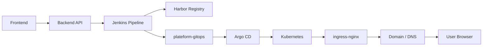
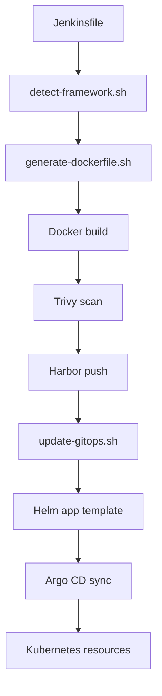

# Jenkins Pipeline and Infra Guide

This document explains how the Jenkins pipeline works in this platform and what each important file inside `plateform-infra` is used for.

It is written for the people who will maintain, extend, or troubleshoot the deployment flow.

## Big Picture

The platform works like this:

1. A user clicks deploy in the frontend.
2. The backend creates or updates the project record.
3. The backend triggers Jenkins.
4. Jenkins builds the app image, scans it, pushes it to the registry, and updates GitOps.
5. Argo CD watches GitOps and syncs the Kubernetes resources.
6. Kubernetes exposes the app through ingress and DNS.



## Jenkins Pipeline Overview

The active pipeline lives in:

- `plateform-infra/jenkins/Jenkinsfile`

The pipeline is the automation engine for the whole platform. It does not just build code. It also:

- checks the user repository
- detects the framework
- creates a Dockerfile if needed
- builds the container image
- scans the image
- uploads scan results
- pushes the image to Harbor
- writes the release values into GitOps

The image tag is immutable and usually looks like:

```text
<userId>-<buildNumber>-<commitSHA>
```

That makes every deploy traceable.

## Jenkins Stages

### 1. Validate input

This is the safety gate at the beginning of the pipeline.

What it does:

- checks that required parameters exist
- validates the repository URL
- validates the app name / project name
- validates the port number
- normalizes environment values like user ID and workspace ID

Why it matters:

- it fails fast before any heavy work begins
- it prevents broken deploys from going through the build process
- it keeps bad input from reaching GitOps or Harbor

Typical problems caught here:

- missing repository URL
- invalid port value
- empty project name
- malformed registry URL

### 2. Checkout infra

This stage pulls the shared platform repository itself.

What it does:

- checks out `plateform-infra`
- makes the shared scripts available to the job
- loads the Helm templates and Dockerfile templates

Why it matters:

- the pipeline depends on these shared scripts
- Jenkins needs the platform templates before it can build or update GitOps

If this stage fails, Jenkins cannot continue because it does not have the platform logic it needs.

### 3. Checkout user repository

This stage checks out the user's application code.

What it does:

- clones the GitHub repo selected by the user
- checks out the branch selected by the user
- reads the current commit SHA
- builds the final image name
- builds the final image tag
- normalizes the project and workspace names

Why it matters:

- this is the real source code that will be built into the app image
- the commit SHA is used for traceability
- the app name and workspace ID become part of the release identity

Output from this stage:

- user source code in the workspace
- computed image repository
- computed image tag
- full image reference for the deploy

### 4. Detect framework

This stage figures out what kind of app the user has pushed.

The detection script is:

- `plateform-infra/jenkins/scripts/detect-framework.sh`

What it does:

- checks the repo files
- determines whether the app is Next.js, React, Node.js, Spring Boot, Gradle, Python, FastAPI, Flask, Laravel, PHP, or static content

Why it matters:

- the platform can support several frameworks with one pipeline
- the detected framework decides which Dockerfile template will be used

This stage is what makes the pipeline “smart” instead of hardcoded to one app type.

### 5. Prepare Dockerfile

This stage creates a Dockerfile only when the user repo does not already have one.

The script is:

- `plateform-infra/jenkins/scripts/generate-dockerfile.sh`

What it does:

- checks whether the user repo already has a `Dockerfile`
- if a Dockerfile exists, it keeps the user version
- if not, it copies the correct template from `plateform-infra/docker/dockerfiles/`

Why it matters:

- users can provide their own Dockerfile if they want full control
- beginners can still deploy without writing Dockerfile manually
- the platform stays consistent across many frameworks

### 6. Build → Scan → Push

This is the main build stage.

What it does:

1. builds the Docker image
2. runs vulnerability scanning with Trivy
3. uploads scan results to DefectDojo
4. logs in to Harbor
5. pushes the image to the registry

Why it matters:

- the app image is created here
- security scanning happens before publishing
- the registry image becomes the immutable artifact that GitOps points to

Notes:

- this stage often runs on a dedicated Jenkins agent
- it is the longest stage because build and scan work take time
- if Trivy finds issues, the pipeline can still continue depending on the configured exit code

### 7. Update GitOps repository

This is the GitOps handoff stage.

The script is:

- `plateform-infra/jenkins/scripts/update-gitops.sh`

What it does:

- clones the GitOps repository
- finds the correct tenant folder
- writes or updates `values.yaml`
- updates the image repository and tag
- updates host/domain and ingress values
- ensures the namespace manifest exists
- commits and pushes the change back to GitOps

Why it matters:

- this is the bridge between CI and CD
- Jenkins does not deploy directly to the cluster
- Argo CD reads GitOps and applies the new desired state

This is the most important step for GitOps flow.

### 8. Declarative: Post Actions

This is the cleanup and final status stage.

What it does:

- cleans the Jenkins workspace
- prints a success or failure message
- makes sure leftover files do not pollute the next job

Why it matters:

- keeps the Jenkins worker clean
- avoids stale state from one build affecting another

## What Each Important Infra File Does

The `plateform-infra` repository is the shared deployment engine. Below is the file map.

### Jenkins files

#### `plateform-infra/jenkins/Jenkinsfile`

Main pipeline definition.

Use it for:

- CI/CD flow control
- stage definitions
- credential usage
- image build and push
- GitOps update trigger

#### `plateform-infra/jenkins/scripts/detect-framework.sh`

Detects the application framework from the user repository.

Use it for:

- picking the right Dockerfile template
- supporting many app types with one pipeline

#### `plateform-infra/jenkins/scripts/generate-dockerfile.sh`

Copies the correct Dockerfile template into the user app when the app does not already provide one.

Use it for:

- automatic Dockerfile generation
- standardizing builds across frameworks

#### `plateform-infra/jenkins/scripts/build-app.sh`

Helper build script for framework-specific builds.

Use it for:

- manual or experimental builds
- framework-specific build commands

Important note:

- this file is a helper script
- it is not the main active path in the current Jenkinsfile

#### `plateform-infra/jenkins/scripts/update-gitops.sh`

Writes the deploy result into GitOps.

Use it for:

- creating the tenant app folder
- writing Helm values for image, host, namespace, and ingress
- pushing the release state into `plateform-gitops`

This script is the CD handoff.

### Docker templates

The Docker templates live here:

- `plateform-infra/docker/dockerfiles/`

Files in this folder:

- `Dockerfile.nextjs`
- `Dockerfile.react`
- `Dockerfile.nodejs`
- `Dockerfile.springboot`
- `Dockerfile.gradle`
- `Dockerfile.fastapi`
- `Dockerfile.flask`
- `Dockerfile.python`
- `Dockerfile.laravel`
- `Dockerfile.php`
- `Dockerfile.static`

Use them for:

- generating a framework-specific container image
- giving each framework a sane default build/run pattern

### Helm app template

The Helm chart is in:

- `plateform-infra/helm/app-template/`

#### `Chart.yaml`

Defines the Helm chart metadata.

Use it for:

- chart identity
- chart versioning
- chart description

#### `values.yaml`

Provides default values for tenant apps.

Use it for:

- app name
- user ID
- workspace ID
- namespace
- image repository and tag
- service port
- ingress host
- TLS settings
- environment variables
- autoscaling

This is the file Jenkins rewrites into the GitOps repo for each deploy.

#### `templates/_helpers.tpl`

Helm helper functions for naming and labels.

Use it for:

- consistent resource names
- consistent Kubernetes labels
- shorter template expressions

#### `templates/deployment.yaml`

Deployment template for the user app.

Use it for:

- creating the workload pods
- setting the image
- defining container ports
- setting probes and env vars

#### `templates/service.yaml`

Service template for exposing the app inside the cluster.

Use it for:

- stable cluster networking
- routing to the deployment pods

#### `templates/ingress.yaml`

Ingress template for external traffic.

Use it for:

- host-based routing
- TLS configuration
- cert-manager integration
- public domain exposure

#### `templates/hpa.yaml`

Horizontal Pod Autoscaler template.

Use it for:

- scaling the app based on load

### Kubernetes helper manifests

The Kubernetes helper files are in:

- `plateform-infra/kubernetes/`

#### `namespace.yaml`

Defines a base namespace manifest.

Use it for:

- pre-creating a namespace
- keeping platform bootstrap resources organized

#### `registery-secret.yaml`

Registry secret example manifest.

Use it for:

- pulling images from the registry
- creating the `registry-secret`

Note:

- the filename keeps the project spelling `registery`
- the manifest is used as a reference for creating the secret

#### `nginx-ingress/values.yaml`

Placeholder values file for NGINX ingress customization.

Use it for:

- ingress controller overrides
- cluster-specific ingress configuration

### Reference and history docs

These files are useful as design notes and historical references:

- `plateform-infra/Jenkines-v1.md`
- `plateform-infra/Jenkins-v2.md`
- `plateform-infra/jenkins-v3-current-working.md`
- `plateform-infra/readme.md`

Use them for:

- comparing older pipeline designs
- understanding how the pipeline evolved
- keeping notes about previous implementation choices

## How the Infra Pieces Work Together

The file groups are not independent. They form one release chain:

1. Jenkinsfile controls the pipeline.
2. Framework detection chooses the right template.
3. Dockerfile generation makes the app buildable.
4. Image build creates the release artifact.
5. GitOps update writes the release values into Git.
6. Argo CD reads the GitOps repo.
7. Helm chart renders Kubernetes resources.
8. Kubernetes creates the namespace, deployment, service, ingress, and optional HPA.



## What To Edit When You Want To Change Something

### If you want to change how apps are built

Edit:

- `plateform-infra/jenkins/Jenkinsfile`
- `plateform-infra/jenkins/scripts/detect-framework.sh`
- `plateform-infra/jenkins/scripts/generate-dockerfile.sh`

### If you want to change the generated container image

Edit:

- `plateform-infra/docker/dockerfiles/*`

### If you want to change the Kubernetes resources

Edit:

- `plateform-infra/helm/app-template/templates/deployment.yaml`
- `plateform-infra/helm/app-template/templates/service.yaml`
- `plateform-infra/helm/app-template/templates/ingress.yaml`
- `plateform-infra/helm/app-template/templates/hpa.yaml`

### If you want to change the default deployment values

Edit:

- `plateform-infra/helm/app-template/values.yaml`

### If you want to change how GitOps folders are written

Edit:

- `plateform-infra/jenkins/scripts/update-gitops.sh`
- the matching ApplicationSet in `plateform-gitops/bootstrap/`

### If you want to change namespace or registry helper manifests

Edit:

- `plateform-infra/kubernetes/namespace.yaml`
- `plateform-infra/kubernetes/registery-secret.yaml`

## Short Glossary

- **CI**: build, test, scan, and package the app
- **CD**: publish the desired state so the cluster updates itself
- **GitOps**: Git is the source of truth for Kubernetes state
- **Argo CD**: controller that syncs Kubernetes from Git
- **Harbor**: container registry where built images are stored
- **Ingress**: HTTP/HTTPS entry point into the cluster
- **Namespace**: isolated Kubernetes area for one tenant or app

## Summary

In this platform:

- Jenkins is the delivery engine
- Helm is the Kubernetes packaging format
- GitOps is the deployment source of truth
- Argo CD is the reconciler
- Kubernetes is the runtime

That is why one deploy can go from source code to a live URL without manual kubectl work.
