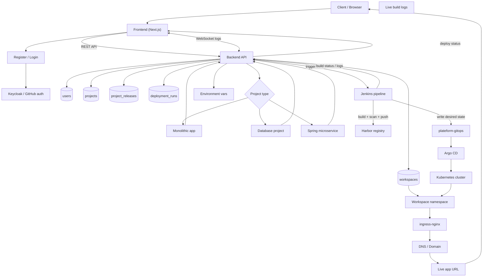

# Production Flow

This page shows the full production path from the browser to a running app in Kubernetes.

It includes:

- login and bootstrap
- workspace creation
- namespace creation
- project type selection
- deploy, logs, rollback, and live URL delivery

## Short explanation

The browser talks to the frontend.  
The frontend talks to the backend.  
The backend creates the user and workspace records.  
Jenkins builds and publishes the app.  
GitOps stores the desired state.  
Argo CD syncs Kubernetes.  
The browser gets the live URL at the end.

## Recommended production rule

Use this rule for the platform:

- `workspace` = business tenant boundary
- `namespace` = Kubernetes runtime boundary
- `project type` = deployment template choice

That means the backend owns the workspace, and the runtime namespace is derived from it.

For production, that is the cleanest way to keep the platform organized.

## Full production flow

## Step by step

### 1. User opens the platform

The client opens the frontend in the browser.

The frontend shows:

- sign in
- project list
- deploy form
- live logs
- release history
- live URL

### 2. User registers or logs in

The user signs in through the identity provider.

After login, the backend creates or updates:

- `users`
- the personal `workspace`
- the workspace ownership record

This is the bootstrap step for the account.

### 3. Backend prepares the namespace

After the workspace is known, the platform can derive a Kubernetes namespace from it.

Recommended pattern:

- workspace is the source of truth
- namespace is generated from workspace or user identity

That lets you keep one namespace per tenant, which is easy to explain and easy to operate.

### 4. User chooses a project type

Your platform supports three project types:

- monolithic
- database
- spring microservice

How they usually map:

- **Monolithic**: one deployment, one service, one ingress
- **Database**: one database workload, often a StatefulSet or chart
- **Spring microservice**: multiple services or deployments inside the same tenant boundary

### 5. User enters repo, env, and domain

The frontend sends the project request to the backend.

The backend stores:

- repository URL
- branch
- app name
- environment variables
- custom domain
- framework
- runtime port

### 6. Backend stores project and release history

The backend writes the state into PostgreSQL:

- current project config
- release snapshot
- version history
- env vars
- rollback records

This is what makes rollback possible later.

### 7. Jenkins builds and publishes

The backend triggers Jenkins.

Jenkins then:

1. checks out the user repo
2. detects the framework
3. prepares the Dockerfile
4. builds the image
5. scans the image
6. pushes it to Harbor
7. updates the GitOps repo

### 8. GitOps becomes the source of truth

Jenkins writes the final desired state into `plateform-gitops`.

That state includes:

- image repository
- image tag
- namespace
- host
- port
- Helm values
- env vars

### 9. Argo CD syncs Kubernetes

Argo CD watches the GitOps repo.

When a new commit appears:

- Argo CD renders the chart
- Argo CD compares live state vs desired state
- Argo CD applies the change
- Kubernetes starts the app

### 10. Ingress and DNS expose the app

The app becomes reachable when:

- the pod is healthy
- the service is ready
- ingress is created
- DNS points to ingress

The frontend shows the live URL after the deploy completes.

### 11. Logs and status go back to the user

The browser keeps a live connection to the backend.

The backend relays Jenkins build progress, so the user sees:

- queued
- building
- pushing
- updating GitOps
- synced
- deployed

### 12. Rollback uses the same production pipeline

Rollback does not rebuild from scratch.

The backend picks an older release from the database and asks Jenkins to update GitOps with the previous tag.

Then:

- Jenkins updates the old version in GitOps
- Argo CD syncs it again
- Kubernetes returns to the old release

## How workspace and namespace work together

| Concept | Meaning | Example |
| --- | --- | --- |
| Workspace | Business tenant space | `ws-159990218` |
| Namespace | Kubernetes runtime space | `ws-159990218` or `user-159990218` |
| Project | One deployable app | `tochratana-template-nextjs-7581` |
| Release | One version snapshot | `v1.0.3` |

My recommendation is:

- keep workspace in the backend
- derive namespace from the workspace
- reuse that namespace for all project types unless you need stronger isolation later

## Client-friendly summary

You can explain the whole system like this:

1. The user signs in.
2. The platform creates the workspace and tenant namespace.
3. The user chooses what to deploy.
4. Jenkins builds and publishes the app.
5. GitOps stores the desired state.
6. Argo CD deploys it to Kubernetes.
7. The browser gets the live URL.
8. Rollback restores an older saved version.

## Why this is production-friendly

- one place to manage user and workspace data
- one clear deploy path
- Git is the audit trail
- GitOps keeps the cluster consistent
- rollback is traceable
- each tenant stays isolated

## Summary

The production model is:

- **Frontend** for user actions
- **Backend** for orchestration and state
- **Jenkins** for build and publish
- **GitOps** for desired state
- **Argo CD** for sync
- **Kubernetes** for runtime

That is the full path from browser to live app.
